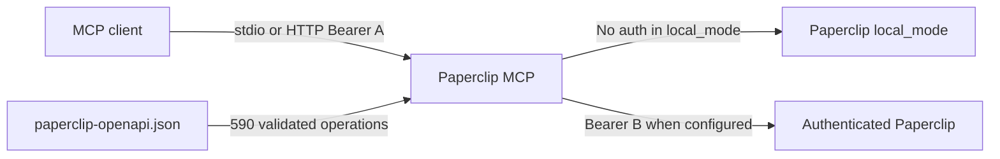

# Paperclip MCP

**Complete, schema-driven Model Context Protocol access to the Paperclip API.**

Paperclip MCP turns the supplied `paperclip-openapi.json` contract into typed MCP tools
without maintaining a second, drifting interface registry. It exposes all 590 documented
operations over stdio or authenticated Streamable HTTP, handles Paperclip deployments both
with bearer authentication and in tokenless `local_mode`, and preserves the path, query,
body, and authorization boundaries described by the source document.

## What it provides

- One direct, schema-validated `pc_*` MCP tool for every OpenAPI method/path operation.
- Bounded `paperclip_list_operations` discovery and `paperclip_call_operation` dispatch by
  stable `METHOD /path/{template}` keys.
- Correct OpenAPI 3.0 nullable and exclusive-bound translation, path escaping, and query
  array serialization.
- JSON, text, JSONL, SSE transcript, and base64 binary responses behind one result envelope.
- Separate inbound MCP and outbound Paperclip bearer credentials; inbound credentials are
  never forwarded upstream.
- Optional upstream authentication: omit the Paperclip token for `local_mode`, or configure
  a board/agent bearer token when Paperclip requires authentication.
- Loopback-bound, non-root, read-only, capability-free Docker deployment with secret mounts,
  health/readiness probes, and resource limits.

## Architecture



Bearer A protects this service's HTTP endpoint. Bearer B belongs to Paperclip. They must be
different, and neither is accepted as MCP tool input.

## Quick start

Python 3.12 is required.

```bash
scripts/bootstrap.sh
export PAPERCLIP_BASE_URL=http://127.0.0.1:3100
```

For Paperclip `local_mode`, do not set `PAPERCLIP_API_TOKEN`:

```bash
.venv/bin/paperclip-mcp stdio
```

For a Paperclip instance that requires board or agent authentication:

```bash
export PAPERCLIP_API_TOKEN='paperclip-issued-token'
.venv/bin/paperclip-mcp stdio
```

The credential type determines which board-only, instance-admin, or agent-capable operations
Paperclip will authorize. The MCP does not elevate upstream permissions.

### Streamable HTTP

Create a gateway-only token and start the service:

```bash
.venv/bin/paperclip-mcp token --output secrets/mcp_token
export PAPERCLIP_MCP_TOKEN_FILE="$PWD/secrets/mcp_token"
.venv/bin/paperclip-mcp http
```

Connect an MCP client to `http://127.0.0.1:8000/mcp` with:

```text
Authorization: Bearer <contents of secrets/mcp_token>
```

`GET /healthz` checks only the gateway. `GET /readyz` performs the public Paperclip health
request and therefore works in both upstream authentication modes. On loopback, the inbound
MCP token may be omitted for local development. Non-loopback binds fail closed unless it is
configured.

## Docker

Generate the inbound token file:

```bash
.venv/bin/paperclip-mcp token --output secrets/mcp_token
export PAPERCLIP_BASE_URL=http://host.docker.internal:3100
docker compose up --build -d
```

That starts against Paperclip `local_mode` with no upstream authorization header. For an
authenticated Paperclip deployment, add the secret-only overlay:

```bash
install -m 600 /secure/path/paperclip-api-token secrets/paperclip_api_token
docker compose -f compose.yaml -f compose.auth.yaml up --build -d
```

The host port stays on `127.0.0.1`. If Paperclip is another Compose service, place both on an
appropriate user-defined network and set `PAPERCLIP_BASE_URL` to its service URL; do not use
`127.0.0.1` inside this container to refer to the host.

## Tool input and output

Direct tools group URL values so names cannot collide:

```json
{
  "path": {"companyId": "company-123"},
  "query": {"limit": 25},
  "body": {"title": "Example"}
}
```

The source contract currently omits request schemas for three upload routes. Their tools
provide a marked compatibility input:

```json
{
  "path": {"companyId": "company-123"},
  "multipart": {
    "file": {
      "filename": "diagram.png",
      "media_type": "image/png",
      "data_base64": "iVBORw0KGgo..."
    }
  }
}
```

Success results use `{status_code, content_type, headers, body, encoding}`. Non-success
responses become MCP tool errors. See the
[generated reference](docs/generated/mcp-tools.md) and
[MCP client guide](docs/mcp-clients.md).

## Documentation

- [Architecture and contract generation](docs/architecture.md)
- [MCP client configuration](docs/mcp-clients.md)
- [Operations and credential rotation](docs/operations.md)
- [Security model](docs/security.md)
- [Testing and evidence boundaries](docs/testing.md)
- [Generated tool reference](docs/generated/mcp-tools.md)

## Development

```bash
scripts/ci-bootstrap.sh
scripts/validate.sh
```

Validation checks formatting, lint, strict typing, compilation, the full test suite with
branch coverage, generated documentation, distributions, and both Compose modes. Live
Paperclip acceptance and built-container security checks are separate operator-run gates;
mocked upstream tests do not constitute live service evidence.
