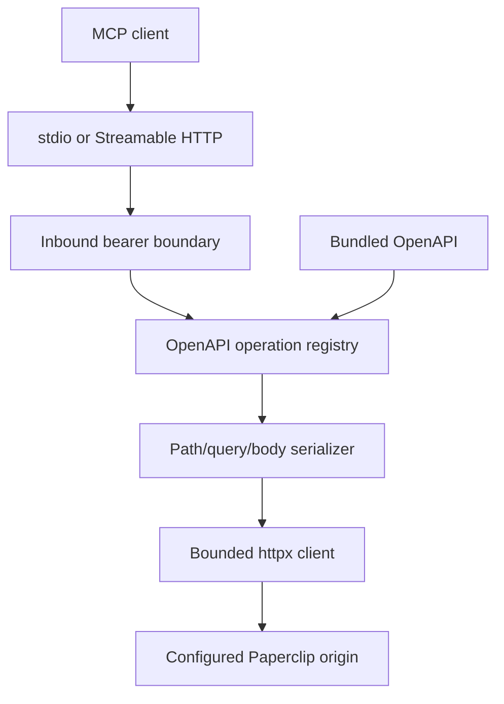

# Architecture

Paperclip MCP is a stateless protocol gateway. It owns no Paperclip business data and
persists no API response. At startup it validates the bundled OpenAPI document, translates
the OpenAPI 3.0 schema dialect to MCP-compatible JSON Schema, and creates an immutable
registry keyed by `METHOD /path/{template}`.

## Components

- `openapi.py` owns document loading, dialect translation, stable direct-tool naming,
  annotations, and the one-to-one operation registry.
- `server.py` owns MCP discovery, direct and key-based dispatch, resources, HTTP bearer
  authentication, health, and readiness.
- `client.py` owns fixed-origin request construction, URL-template escaping, query-style
  serialization, response-size limits, content decoding, and safe errors.
- `config.py` owns environment parsing and the separation of inbound and outbound secrets.

## Interface generation

The supplied contract has 475 paths, 590 operations, 36 tags, and no `operationId` values.
The method/path pair is therefore the stable identifier. A direct tool name begins with
`pc_`, describes the method and path, and is capped at 64 characters; long names end with a
hash of the unmodified operation key. Collisions fail startup.

Every direct input keeps path, query, and body values in separate objects. Inline
constraints, required fields, enums, one-of branches, array rules, and defaults are carried
into the MCP schema. OpenAPI `nullable: true` and boolean exclusive bounds are translated
before MCP validation. Runtime dispatch accepts only a registry entry: callers cannot
provide an arbitrary method, URL, header, cookie, or credential.

The full registry is also available as the `paperclip://operations` MCP resource; the source
document is `paperclip://openapi`. `paperclip_list_operations` offers paged discovery so a
client need not place the entire manifest in model context.

## Authentication modes

There are two independent boundaries:

1. The optional inbound gateway token protects `/mcp`. It is required whenever the HTTP
   server binds outside loopback and is always configured by the hardened Compose service.
2. The optional upstream Paperclip token is added only to operations whose OpenAPI
   `security` array is non-empty.

When the upstream token is absent, authenticated-marked operations are still sent without
an `Authorization` header. This is intentional and supports Paperclip `local_mode`, where
the server does not require bearer authentication. When a token is present, public
operations still receive no credential.

## Source-contract gaps

The current OpenAPI omits bodies for three uploads and several compatibility routes, omits
OAuth callback parameters, and leaves some binary/text/stream success schemas open. The
gateway does not silently invent typed fields. Write-like operations without a body schema
receive an optional open JSON compatibility body; the three clearly identified upload
operations additionally receive bounded multipart file fields. Response handling follows
the actual content type and size limit.

These accommodations preserve usability while keeping every deviation visible in tool
descriptions and generated documentation. Correcting the upstream OpenAPI remains the
preferred long-term fix.
